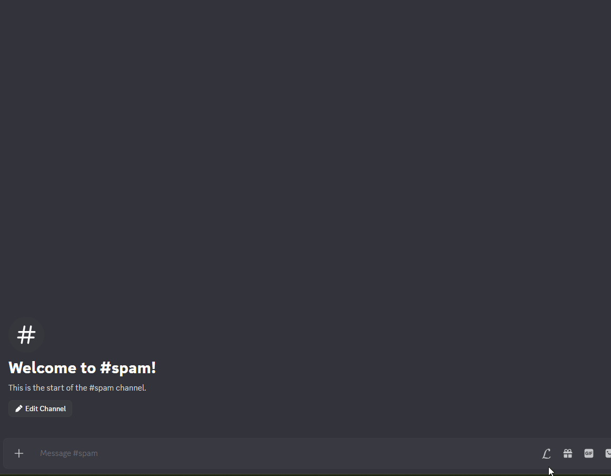
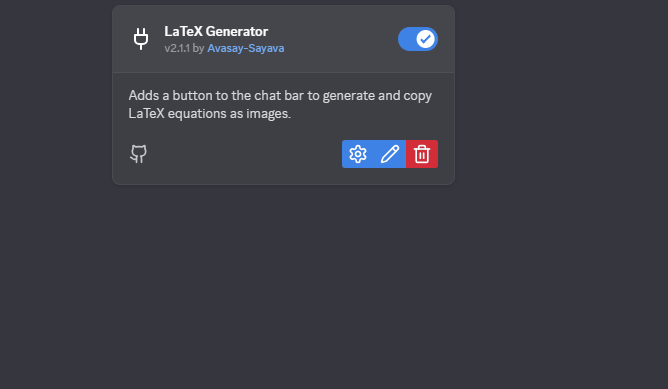
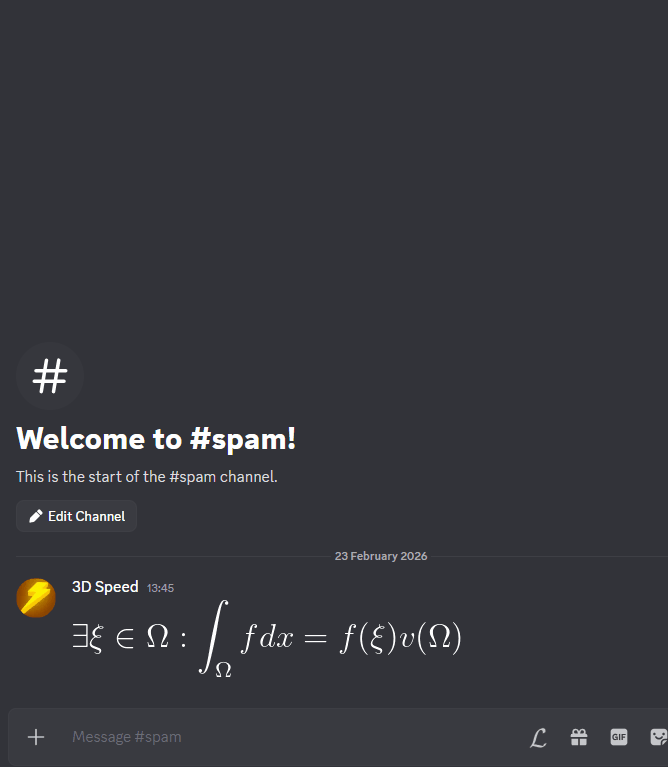

# LaTeXGenerator
A BetterDiscord plugin that generates LaTeX code. It uses the [CodeCogs LaTeX API](https://latex.codecogs.com/) api to render the LaTeX code into an image. It also provides a preview of the rendered image before sending. Because the LaTeX code is sent as an image, it can be shared with users who do not have the plugin installed.

## Regular Usage:

## With Auto Preview Enabled:
### Enable in Settings

### After Enabling

